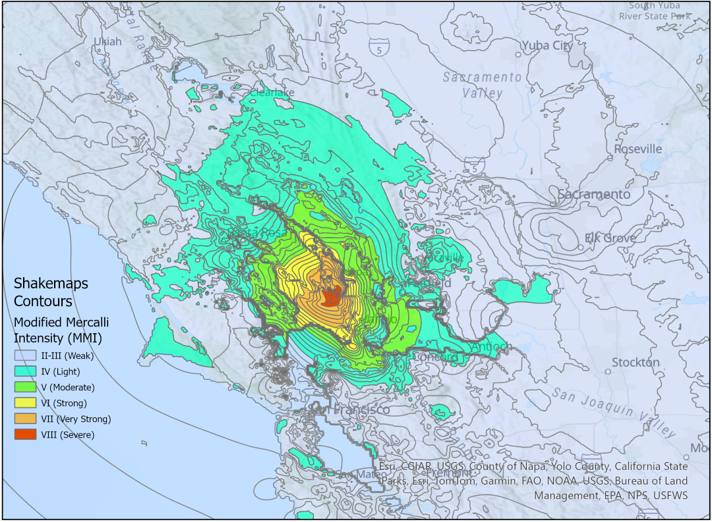

# About me

Hi!  I'm Meriem (she/her) and here's a little about me:

🎓 Recently graduated from Carnegie Mellon University with a Masters in Data Analytics, Public Policy and Management

🔍 Actively seeking data science and analytics roles

💻 3+ years in data science and analytics in the energy and environmental industry

⚡ Passionate about clean energy and decarbonization

🎓 Dartmouth Grad with a Bachelor’s in Economics and Computer Science

🚲 Love biking, kayaking and cooking

# My Projects

##  [American Red Cross Project: Predictive Modeling of Earthquake Impacts to Housing](https://github.com/ItsMeriem/earthquake_shelter_model/tree/main)

During my capstone project at CMU, I developed a predictive tool for the American Red Cross (RC) to forecast in real time the number of people expected to seek shelter in the aftermath of an earthquake. This product is **the first open source earthquake model** to provide the Red Cross with shelter demand estimates. Unlike existing tools, it is fast (runs in minutes), open source, and does not require complex software installations beyond Python. It is expected to reduce the time needed to deploy life-saving resources by 3 days, ensuring the RC can help people as rapidly as possible.

     

## The New Alley: How the Tornado Alley is Shifting East

How did tornado patterns change from 2001 to 2021? To answer this, I used ArcGIS Pro's ModelBuilder to build a model that combines 3 weighted raster maps into an overall index raster map. I combined three measures of tornado damage: injuries to persons, fatalities of persons, and property loss. Specifically, I used Kernel Density Smoothing to combine the damage measures into one raster map. 

  <table>
    <tr>
      <td style="padding-right: 10px;"></td>
      <td style="padding-left: 10px;"></td>
    </tr>
  </table>

## [Automatic Speech Recognition Using Neural Networks](https://nbviewer.org/github/ItsMeriem/Meriem/blob/main/Speech%20Recognition/UtterancetoPhonemeMapping.ipynb)

Check out how I implemented an Automatic Speech Recognition network using RNNs (Bi-LSTMS, and p-BLSTMs), a Connectionist Temporal Classification (CTC), and dynamic programming to process human speech into written text.

    

## [Fairness in Federated Learning](https://github.com/rivera-lanasm/flfair_idlf24/) 

Federated learning (FL) is a framework that allows distributed learning for neural networks and other machine learning models. Disparate servers with private data iteratively (1) share learned model parameters with a central server and (2) receive aggregated model parameters from the central server.

We **tested a novel approach to improve individual fairness outcomes in Federated Learning**, without sacrificing privacy or accuracy. We use a feed forward Neural Network to classify recidivism cases from the COMPAS dataset, and evaluate individual and group fairness scores through different algorithmic techniques.

  <a href="https://drive.google.com/file/d/18o0HTSjobRYRX5yXMQSVGRwoyJZB7Lbb/view?usp=sharing">Link to Our Paper on Fairness in Federated Learning</a>

  <a href="https://github.com/rivera-lanasm/flfair_idlf24/">Link to the Github Repo with FL Code</a>

  

    

---
