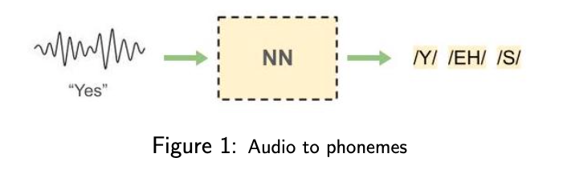

| [Home Page](https://itsmeriem.github.io/Meriem/)  | [Automatic Speech Recognition](UtterancetoPhonemeMapping.ipynb) | [Fairness in Federated Learning](fairness_in_FL.md) | [Poorer Pennsylvania Residents are Dying of Steel](https://carnegiemellon.shorthandstories.com/air-pollution-clairton-pa/index.html)

<h1 align="center">Welcome to Meriem's portfolio!</h1>

# About me

Hi!  I'm Meriem (she/her) and here's what you need to know about me:

📚 Current Public Policy & Data Analytics Masters Student at Carnegie Mellon University

💻 3+ years in data-driven energy and environmental policy research and data science using Python and R

🎓 Dartmouth Grad with a Bachelor’s in Economics and Computer Science

🌍 Passionate about using data to tell stories

🚲 Love biking, kayaking and cooking

# My Projects

## [Automatic Speech Recognition Using Neural Networks](UtterancetoPhonemeMapping.ipynb)
Check out how I implemented an Automatic Speech Recognition network using RNNs (Bi-LSTMS, and p-BLSTMs), a Connectionist Temporal Classification (CTC), and dynamic programming to process human speech into written text.

    

## [Fairness in Federated Learning](fairness_in_FL.md) 
My co-authors and I wrote a paper on how to improve individual and group-level fairness in Federated Learning. Check out our paper and our code.

## [Poorer Pennsylvania Residents are Dying of Steel](https://carnegiemellon.shorthandstories.com/air-pollution-clairton-pa/index.html)
I wrote a story on how Pittsburgh's poorest residents live in a cancer hotspot and how local fine structures fail to ensure a safe environment.

---
## Important Links 
- [Web page URL](https://itsmeriem.github.io/Meriem/)
