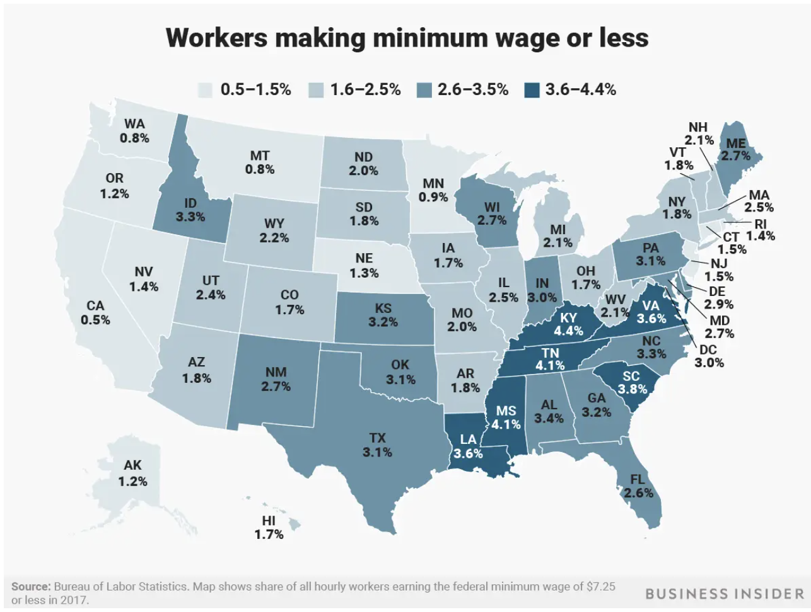
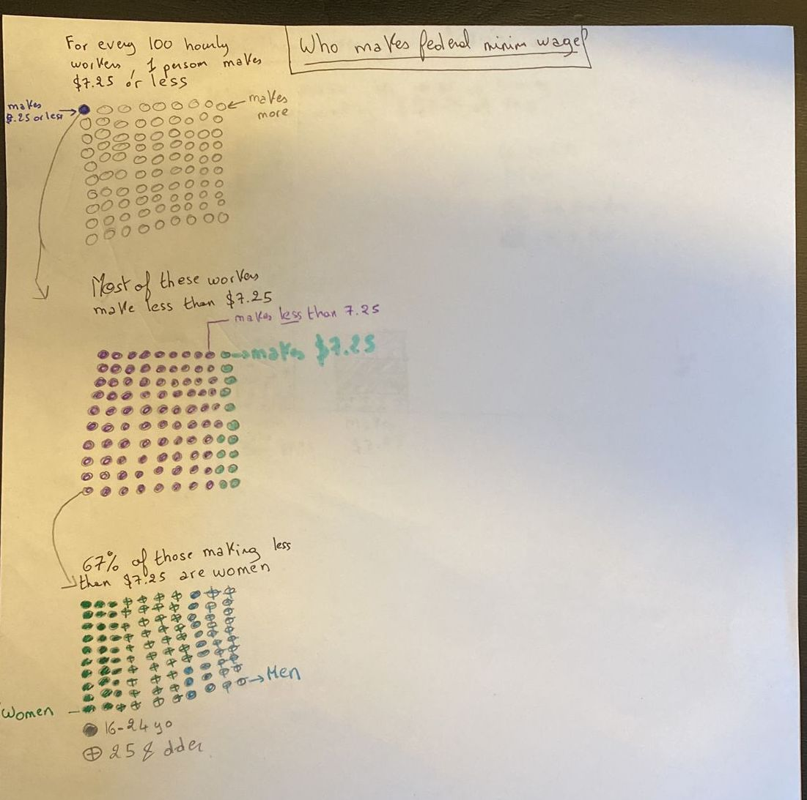
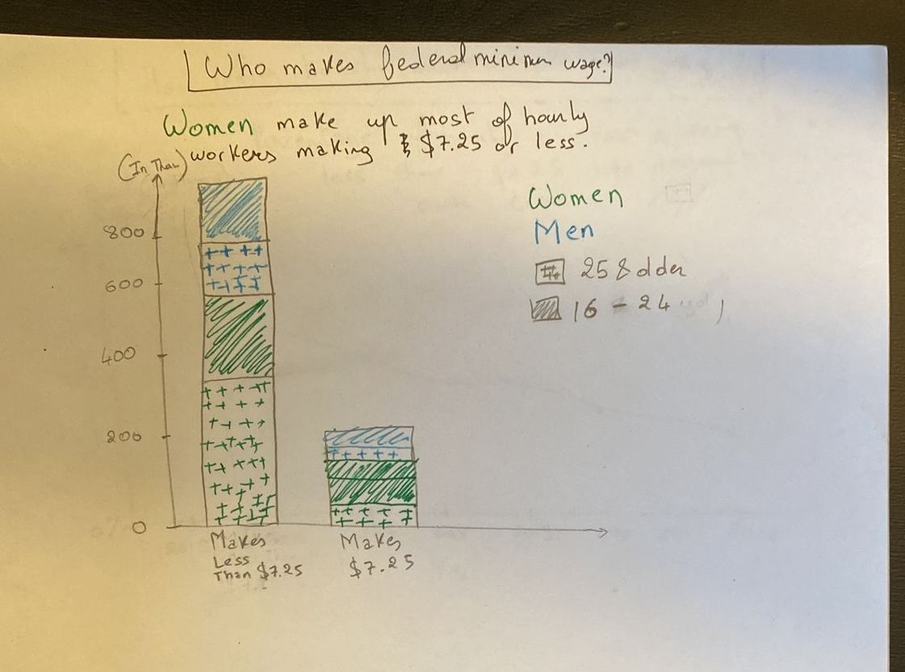
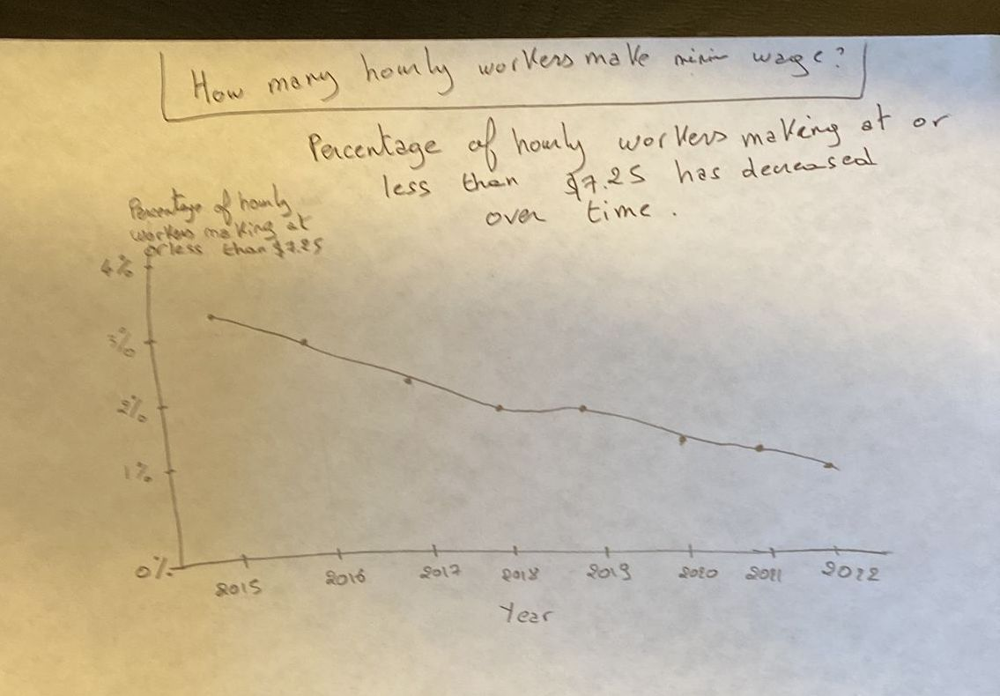

| [home page](https://itsmeriem.github.io/Meriem/) | [Ranking of News Orgs](news-ranking.md) | [visualizing debt](visualizing-debt.md) | [critique by design](critique-by-design.md) | [final project](final-project.md)

# Step 1 and 2: Select and Critique the Visualization

For this assignment, I chose to focus on this [visualization published by Business Insider](https://www.businessinsider.com/federal-minimum-wage-workers-map-2018-10?r=US&IR=T) showing "Workers Making Minimum Wage or Less". The associated MakeoverMonday Data can be found [here](https://data.world/makeovermonday/2023w18). For convenience, I am also attaching a screenshot of the visualization.

For the critique, please refer to the Google form response.

# Step 3: Sketch out a Solution

Pulling from my critique (see response to google form), I set out to resolve a few issues in the original visualization. My goal was to: 

- Move away from state-to-state comparisons and focus on the story at a national-level.
- Focus both on *how many* people make at or below minimum wage but also *who* makes at or below min wage.
- Visualize percentages in a way that may be easier to understand. I find this specifically helpful when talking about percentages of percentages: like 67% of 1% is hard to grasp so I was hoping to find ways to make that easier to work with.

In order to achieve the gaols above, I had to use datasets beyond what [MakeoverMonday](https://data.world/makeovermonday/2023w18) provides. I used the original data source - [Bureau of Labor Statistics](https://www.bls.gov/opub/reports/minimum-wage/2022/home.htm) - to complement my visualization. In particular, I was interested in knowing:
- What are the demographics of people making at or below minimum wage? What is the distribution of age and gender? Popular rhetoric around minimum wage focuses on the idea that most people who make minimum wage are high schoolers or teenagers with low expenses, and therefore, it would increase federal minimum wage would not have much an impact on society. From a policy standpoint, I wanted to know if this had any truth to it.
- What is the exact number of these populations?

Using additional data was necessary to answer my questions.

### Vizualization 1: 3-Panels "Unit" Chart

My first sketch aims to visualize percentages as dots and focuses on *who* makes below minimum wage. I envision these as three interactive panels. In panel 1, users could click on the one dot representing people making at or below $7.25, and that would trigger an effect where we zoom-in on the dot and then the one dot gets "divided" into 100 dots, leading us to the next panel. Find sketches below: 

### Vizualization 2: Bar Chart

### Vizualization 3: Line graph

# Step 4a: Test the Solution

To test my sketches, I interviewed two people. I used the same set of questions for both interviewees and the same questions for all three visualizations. To protect anonymity, I paraphrased their answers.

### User 1: Young Progressional, mid 20s, college educated

#### Vizualization 1: 3-Panels "Unit" Chart

Meriem: Can you tell me what you think this is?

User 1: I think each panel is zooming-in at each level of who makes at or below minimum wage. You zoom in on the first dot and it divides it by people at vs people below minimum wage; and then dividing further by gender vs age. 

Meriem: Can you describe to me the story this is telling you?

User 1: A lot of people are making under minimum wage and most of them are women. And a good number of those are young.

Meriem: Is there anything you find surprising or confusing?

User 1: I find it suprising that so many people make under minimum wage.
What I find confusing is that the third panel has 2 variables. Having two variables (both age and gender) makes it confusing. The legend is also confusing: using both color and shade to represent age and gender is confusing.
Additionally, the title in third panel has nothing to do with age. In the third panel, it seems like half of them are younger and half of them are older. So what’s the point? What are you trying to say here? 

Meriem: Who do you think is the intended audience for this?

User 1: People who are interested in graphs about who makes less than minimum wage. I don’t think the audience is people making less than minimum wage. Audience is to educate broadly

Meriem: Is there anything you would change or do differently?

User 1: If you want to make a point about age, you need to make it separately: on a separte panel.
For the first panel, you need to make me care. What does 1 out of a 100 mean? Can you compare it to something else? Like “that’s the number of people in Pittsburgh” 

Meriem: What do you think of the text (titles, legend etc..)? 

User 1: Good. But you need to stick to the story. There's nothing about age in the third title

#### Vizualization 2: Bar Charts

Meriem: Can you tell me what you think this is?

User 1: This is showing the number of women making less then or at minimum wage vs men, and it's showing age as well.

Meriem: Can you describe to me the story this is telling you?

User 1: Women make less money than men. I'm not sure about age. There’s more older than young women who are making less than 7.25.

Meriem: Is there anything you find surprising or confusing?

User 1: Confusing: Axes are not labelled. Age is not mentioned in the title. Mentioning age in the title will help the readers draw the conclusion. 

Meriem: Is there anything you would change or do differently?

User 1: I would change the title to say: “Of hourly workers making $7.25 or less, Women make up m….”

#### Vizualization 3: Line graph

Meriem: Can you tell me what you think this is?

User 1: This is showing how the number of hourly workers making at or less than 7.25 has decreased over time.

Meriem: Can you describe to me what this is telling you?

User 1: Number of hourly workers has decreased over time

Meriem: Is there anything you find surprising or confusing?

User 1: Very clear. Glad to see it has decreased

Meriem: Who do you think is the intended audience for this?

User 1: Anyone. Much easier to understand.

Meriem: Is there anything you would change or do differently? 

User 1: If you wanted to make it more interesting, you can add lines for gender and age. A line for women , a line for men etc… To show that trends are different for different subgroups

### User 2: Graduate Student, mid 20s

#### Vizualization 1: 3-Panels "Unit" Chart

Meriem: Can you tell me what you think this is / Can you describe to me the story this is telling?

User 2: Overall, it looks like you are trying to display the differences between different groups of people in regards to minimum wage. The panels show differences between men vs. women, and those making less than 7.25 vs. those at 7.25.
From this, I concluded that women make up most of the hourly wokers that do earn 7.25 or less.

Meriem: Is there anything you find surprising or confusing?

User 2: Surprising: that women make up 67%. Does that mean that they are employed more? Do they make more of the sample size? Or do they generally make up more of the low earners? Confusing: The title “for every 100 hourly workers, 1 person makes $7.25 or less” is confusing. 

Meriem: Is there anything you would change or do differently?

User 2: I would clarify that the first two panels are looking at all genders (totals)

Meriem: What do you think of the text (titles, legend etc..)? 

User 2: In the third panel, gender and age together are confusing. Two points are being made in one image so that’s confusing. 

#### Vizualization 2: Bar Charts

Meriem: Can you tell me what you think this is?

User 2: This bar chart is focusing more on the differences between men and women

Meriem: Is there anything you find surprising or confusing?

User 2: Having both age and gender in the legend is confusing.

Meriem: Who do you think is the intended audience for this?

User 2: HR or policy makers

Meriem: Is there anything you would change or do differently?

User 2: I would change the way age is portrayed.

#### Vizualization 3: Line graph

Meriem: Can you tell me what you think this is?

User 2: This is showing me the trend over time of the number of people making at or below minimum wage.

Meriem: Is there anything you find surprising or confusing?

User 2: I am wondering why has the decrease occured? Are more people becoming unemployed? Are companies paying their workers more?

Meriem: Is there anything you would change or do differently?

User 2: I would include an analysis on why this has decreased over time.

# Step 4b: Reflection

Pulling from the two interviews recorded above and the in-class critique exercise, the following similarities came up:

- Users found the combination of color and shading (to represent gender and age) confusing and hard to understand.
- Stacked charts made it hard to compare different chunks.
- In Viz 1 and Viz 2, I did not include age in the titles but included it in the graph and legend. This was confusing to users.
- The titles could be phrased more clearly
- Generally, users liked Viz 1 but thought that its interactive aspect did not easily come through through hand-written sketches. I agree with this statement and I think this was one of the limitations of hand sketching an interactive design: I could not properly communicate my vision via the sketches.

Differences included:
- One of the users liked the simplicity and clarity of the line chart, but classmates (during the in-class critique) found the percentages to be hard to interpret.

Upon reflecting on these comments, I decided to go forward with Visualization number 1 and I made the following changes to my sketches:
- In all three panels, I added a legend that specifies the "size" of the dot (i.e 1 dot = 1 million people). As per the users' feedback, this would help visualize the extent of the population concerned.
- In Panel 1, I changed the title from "For every 100 hourly workers, 1 person makes $7.25 or less" to "For every 100 people getting paid hourly, 1 person makes $7.25 or less". The phrasing "hourly wokers" (used by the Bureau of Labor Statistics) was confusing to users.
- In Panel 3, I changed the legend to rely on color only. Instead of using shading to represent age, I used a difference in opacity of the same hue. I used light blue for older women, dark blue for younger women, light green for older men, and dark green for younger men.
- In Panel 3, I added a sub-title: "Contrary to popular belief that the lowest earners are teenagers, most are aged 25 or older". I used this to frame the reasons behind my addition of the age variable and to help users understand why considering age matters when we discuss minimum wage.

# Step 5: Built My Solution

In building the solution, the biggest challenge was learning how to make interactive designs in Tableau. My vision, as described above, is that each dot takes the users to a new panel (in a sense, each dot gets divided into a new panel of 100 dots). My vision included a "zooming-in" effect. This was very hard, almost impossible to do in Tableau. This is one of the limitations of Tableau. For future designs, I would consider using Figma or a similar design software to implement an interactive design - I think that would be easier (and nicer looking!)

The best workaround I found is to use the "navigation" buttons in Tableau to navigate between panels.
- To navigate from Panel 1 to Panel 2: click on the orange dot
- To navigate from Panel 2 to Panel 3: click on any red dot
- To navigate back to a previous panel: click the "back" button.

This is the best solution I found given the time and software constraints.

The navigation instructions should be pretty straightforward on the visualization itself. Please make sure you see all three panels.

<noscript></noscript><object class='tableauViz'  style='display:none;'><param name='host_url' value='https%3A%2F%2Fpublic.tableau.com%2F' /> <param name='embed_code_version' value='3' /> <param name='site_root' value='' /><param name='name' value='MinWagePanelDesign&#47;Panel1' /><param name='tabs' value='no' /><param name='toolbar' value='yes' /><param name='static_image' value='https:&#47;&#47;public.tableau.com&#47;static&#47;images&#47;Mi&#47;MinWagePanelDesign&#47;Panel1&#47;1.png' /> <param name='animate_transition' value='yes' /><param name='display_static_image' value='yes' /><param name='display_spinner' value='yes' /><param name='display_overlay' value='yes' /><param name='display_count' value='yes' /><param name='language' value='en-US' /><param name='filter' value='publish=yes' /></object>
               

Sources: [Bureau of Labor Statistics](https://www.bls.gov/opub/reports/minimum-wage/2022/home.htm) and [MakeoverMonday](https://data.world/makeovermonday/2023w18)
