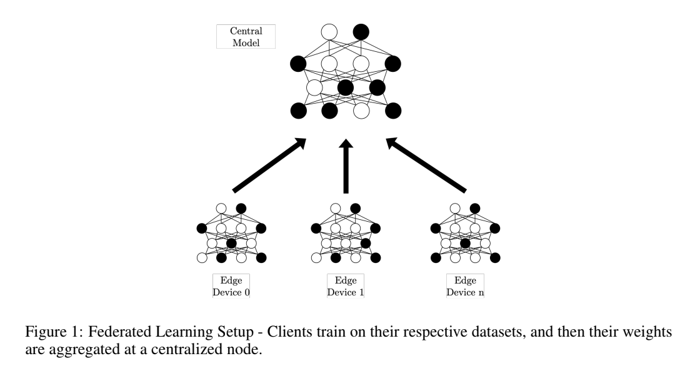

| [Home Page](https://itsmeriem.github.io/Meriem/)  | [Automatic Speech Recognition](UtterancetoPhonemeMapping.ipynb) | [Fairness in Federated Learning](fairness_in_FL.md) | [Poorer Pennsylvania Residents are Dying of Steel](https://carnegiemellon.shorthandstories.com/air-pollution-clairton-pa/index.html)

<h1 align="center">Fairness in Federated Learning</h1>

Federated learning (FL) is a framework that allows distributed learning for neural networks and other machine learning models. Disparate servers with private data iteratively 

  1) share learned model parameters with a central server and
  2) receive aggregated model parameters from the central server
  

We **tested a novel approach to improve individual fairness outcomes in Federated Learning**, without sacrificing privacy or accuracy. We use a feed forward Neural Network to classify recidivism cases from the COMPAS dataset, and evaluate the individual and group fairness scores given through different algorithmic techniques.

  <a href="https://drive.google.com/file/d/18o0HTSjobRYRX5yXMQSVGRwoyJZB7Lbb/view?usp=sharing">Link to Our Paper on Fairness in Federated Learning</a>

  <a href="https://github.com/rivera-lanasm/flfair_idlf24/">Link to the Github Repo with FL Code</a>

