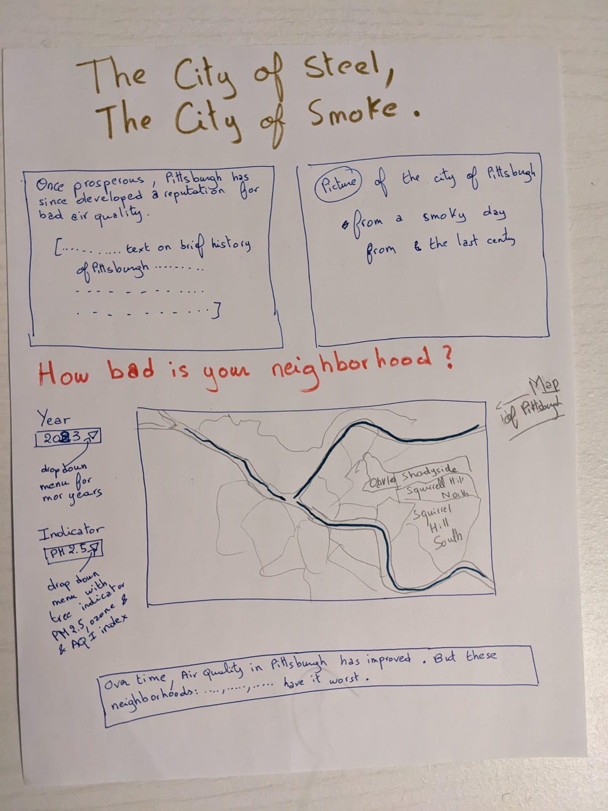
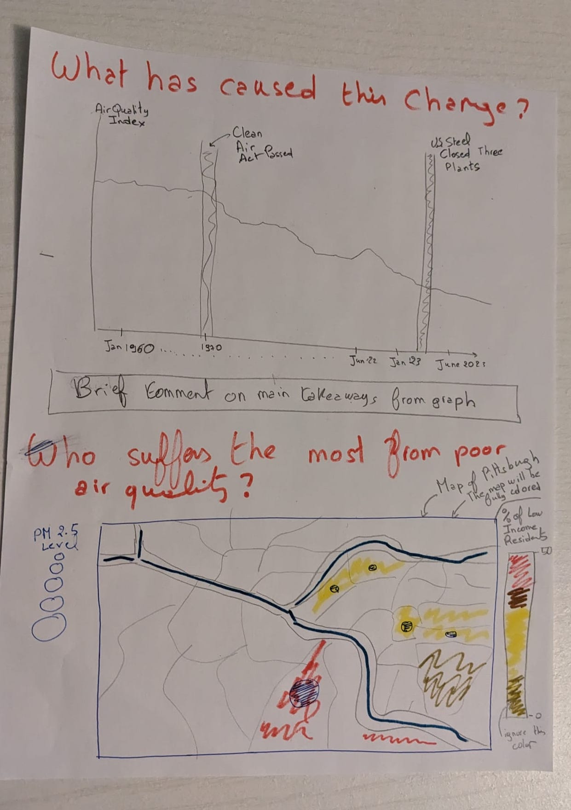

| [home page](https://itsmeriem.github.io/Meriem/) | [Ranking of News Orgs](news-ranking.md) | [visualizing debt](visualizing-debt.md) | [critique by design](critique-by-design.md) | [final project part 1](final-project-part1.md) | [final project part 2](final-project-part2.md) | [final project part 3](final-project-part3.md)  

# Outline

### High Level Summary
For my final project, I'd like to explore air pollution in the Pittsburgh area. Specifically, I'm interested in 
- (a) How  has air quality in Pittsburgh changed over time? And does that change correlate or align with the closing or relocation of steel or coal facilities; and
- (b) Which areas are most affected by air pollution in Pittsburgh? What are the demographics of the residents of areas most affected in terms of environmental justice demographics?

### Project Structure
First, I will start by a brief history of air quality in Pittsburgh, how the city came to be known as the ["City of Smoke"](https://e360.yale.edu/features/for-low-income-pittsburgh-clean-air-remains-an-elusive-goal), and explaining how the steel industry both helped Pittsbrugh prosper economically but also brought about environmental damage.

Then, I will dive into a map visualization of Pittsbrugh that shows how air quality has changed over time. I will focus on a couple metrics: PM 2.5 levels, Air Quality Index (AQI) and ozone pollution. This map will be interactive and users will be able to toggle from one year to the next to compare  yearly change. Users will be also be able to zoom in and out of the map. Fortunately, air quality in Pittsbrugh has [improved over time](https://e360.yale.edu/features/for-low-income-pittsburgh-clean-air-remains-an-elusive-goal), so I expect this part of the story to start off as positive and re-assuring to users.

In the next section, I look at if (a) the passing of federal legislation (like the Clean Air Act) and (b) the closure of power plants (specifically steel and coal) over time has impacted air quality. [The U.S. Steel shit down three polluting batteries earlier this year](https://www.cbsnews.com/pittsburgh/news/dangerous-for-peoples-health-american-lung-association-report-puts-pittsburgh-among-worst-places-for-air-quality/). How has this impacted air quality and how did it take to impact it?

Next, I'll focus on which areas are most impacted and who lives in these areas? I will look specificially at Environmental Justice communities. From my preliminary research it's clear that [low income communities suffer the most](https://e360.yale.edu/features/for-low-income-pittsburgh-clean-air-remains-an-elusive-goal)). I expect this section to be on the more concerning and sadder part of the story. This will consist of the drop in the story arc discussed in class. 

Last but not least, I will give the user ways to act on this issue including contacting the local representatives, reaching to air quality advocacy groups (Pennenvironment), and ways for individuals to protect themselves (air filters at home etc..).

# Initial sketches

Here are my initial sketches. 

# The data

I will use a combination of different datasets:
- [EPA EJ Screen Data](https://www.epa.gov/ejscreen/download-ejscreen-data): This downloadable dataset is the dataset underlining the [EJ Screen Tool](https://ejscreen.epa.gov/mapper/). The dataset can be downloaded at the Census Tract or Census Block level (I will most likely choose to ultimately work at the tract-level). The indicators I'm most interested in are: PM 2.5, Air Toxics Cancer Risk, Ozone, Health Disparities, Asthma, Heart Disease, Low income indicator, percentage of residents that are people of color. I will use this data to map Pittsbrugh at the tract-level and show different indicators. Link: [https://www.epa.gov/ejscreen/download-ejscreen-data](https://www.epa.gov/ejscreen/download-ejscreen-data)

- [Allegheny Air Quality County](https://catalog.data.gov/dataset/allegheny-county-air-quality). Scroll down this page and download "Hourly Air Quality Data". This dataset is provided by the Allegheny department of health and has different AQI metrics (PM2.5, CO, Ozone) over time in differnt neighborhoods of Pittsburgh. This dataset can either be found on [data.gov](https://catalog.data.gov/dataset/allegheny-county-air-quality) or through the [health department directly](https://www.alleghenycounty.us/Health-Department/Programs/Air-Quality/Air-Quality.aspx)

- [List of power stations in Pennsylvania, by county](https://en.wikipedia.org/wiki/List_of_power_stations_in_Pennsylvania#Former_power_stations), including former ones.

# Method and medium

To build my story, I will use Shorthand. This will be an easy and useful way to build a webview of my story. I will need to learn how to embed interactive visualization on Shorthand. To clean and merge the datasets discussed above, I will use R.
