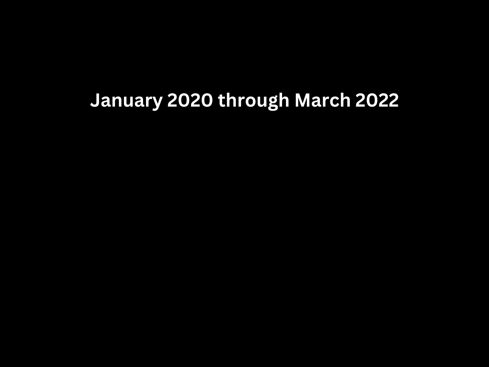
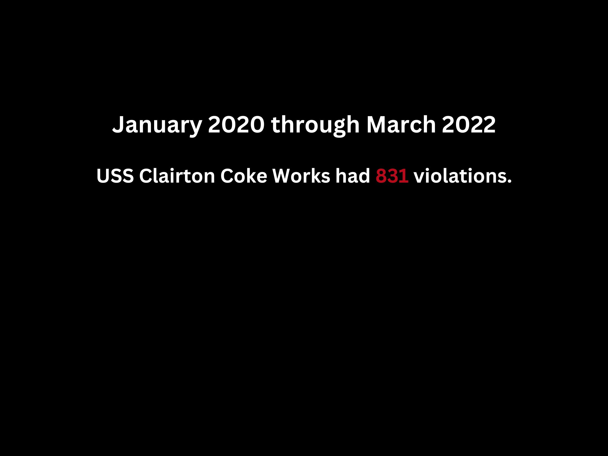
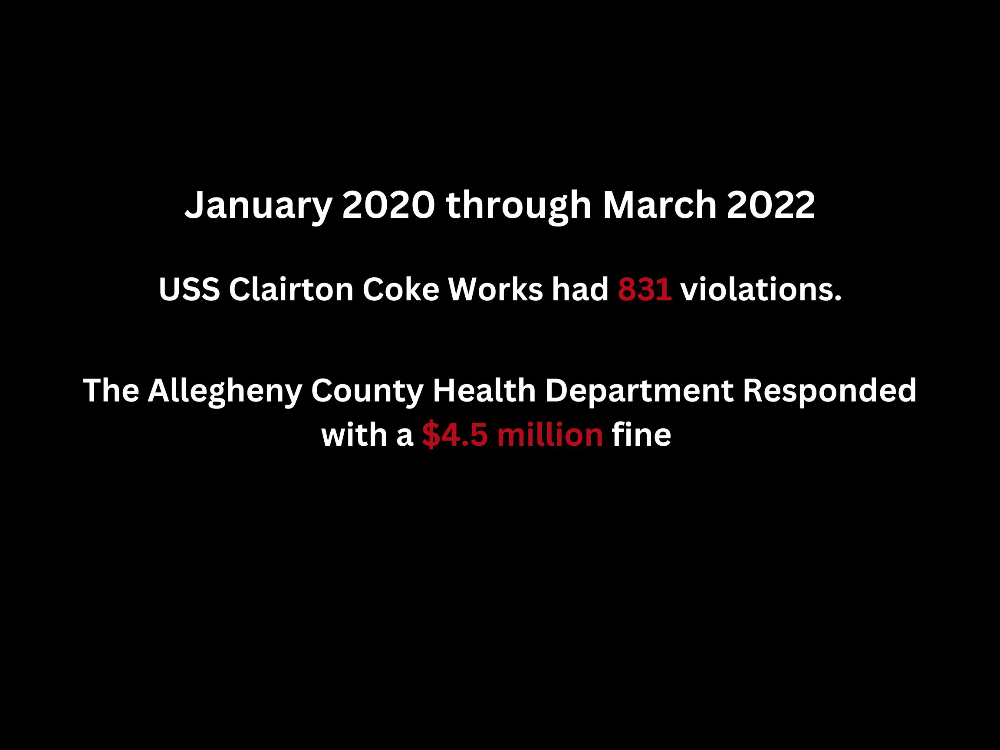
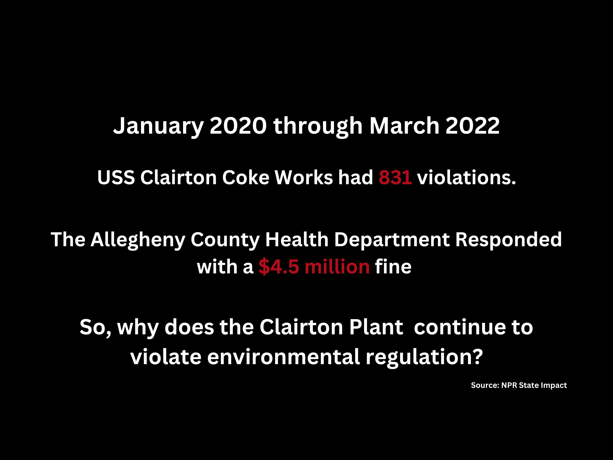

| [home page](https://itsmeriem.github.io/Meriem/) | [Ranking of News Orgs](news-ranking.md) | [visualizing debt](visualizing-debt.md) | [critique by design](critique-by-design.md) | [final project part 1](final-project-part1.md) | [final project part 2](final-project-part2.md) | [final project part 3](final-project-part3.md) 

# Final Project - Part 3

## Final Data Story
The final product can be found on Shorthand [here]() ADD: TO LINK!!!!

## Part 3 Process and Final Changes

Since Part 2, I have made the following changes:
-  **Fine structure**: I added a section exploring how local governemnt has responded to violations by USS Clairton Plant and if the fines that have been issued are incentive enough to reduce environmental violations.
-  **Audience**: Refining my audience to cater to policymakers
- **Design changes**: including clarifying units across all three graphs, using Canva for an inforgraphic-style addition, and using background color to fit in with the story arc (darker background for somber parts and lighter background to take action)
- Updating all images to follow library guidelines.

### Fine Structure

In my part 2 user interviews, it was evident that many users were curious about *why* did violations continue despite multiple fines by the local government. Users wanted to understand if the fines were an effective incentive and if enough was done to enforce compliance. 

First, I wanted to give an overview of how many fines had the USS received for the Clairton Plant in 2022. I did this using visuals from Canva that I combined using a scrollmation. I believe that using call out numebrs to tell this aspect of the story was more effective. I used the four visuals below:

 

Secondly, I wanted to investigate why these fines were not enough of a deterrent. I got data for U.S. Steel (USS) annual profit for 2022, cost of upgrading the plant, and total amount of fines over 2022 (sources for these data are listed below). Using this information, I added a new section to my story where I focused on the fine structure and if they were incentive enough.

For the data visualization, I had a couple versions. I displayed the comparison using a bar chart (see visualization below). Given that the profit is in billions and the fines are in million, it was hard to observe the fine in the bar chart. I tried capitalizing on this difference by using the title to tell the story. See the graph below: 

<noscript></noscript><object class='tableauViz'  style='display:none;'><param name='host_url' value='https%3A%2F%2Fpublic.tableau.com%2F' /> <param name='embed_code_version' value='3' /> <param name='site_root' value='' /><param name='name' value='finevsprofit&#47;Sheet1' /><param name='tabs' value='no' /><param name='toolbar' value='yes' /><param name='static_image' value='https:&#47;&#47;public.tableau.com&#47;static&#47;images&#47;fi&#47;finevsprofit&#47;Sheet1&#47;1.png' /> <param name='animate_transition' value='yes' /><param name='display_static_image' value='yes' /><param name='display_spinner' value='yes' /><param name='display_overlay' value='yes' /><param name='display_count' value='yes' /><param name='language' value='en-US' /><param name='filter' value='publish=yes' /></object>
               

### Audience
In part 2, I had defined my audience as Allegheny county residents who are able to take action towards building a safer future for the residents of Clairton, PA. This includes voters who can pressure local government officials to enforce environmental compliance. It also includes people (voters or non voters) who are able to work with advocacy groups to achieve change.

However, given that I dived deeper into the fines and how they are not effective incentives to enforce compliance with environmental regulation, policy makers became a natural second audience for my story. Therefore, I wanted to ensure that my story, and specifically my call to action, catered to policy makers as well. After reading this story, a policy maker might be wondering which incentives are effective to ensure compliance. So, *I changed my call to action to include more information for policy makers.*

Overall, after a couple iterations, my two audiences are: Allegheny residents and activists who are interested in advocating for a safer future, and policy makers who are interested in improving the incentives to ensure compliance with federal and local regulations.

### Design changes

I made the following design changes: 

##### Tweaks to graphs
My interviews showed that users wanted more clarity in units across all graphs. I updated the graphs accordingly.

##### Leveraging background color 
After discussing with Aman the background colors and my story arc, I decided to sync the background color with my story. Unfortunately, my story is a rather sad one so I used a dark background throughout to convey an appropriate sentiment. But for the call to action, I switched to a light background to inspire a feeling of hope. 

##### "Excess LifeTime Cancer Risk" Chart
In phase 2, the chart below was still a hand-sketched graph. I tried making it on Tableau, however, that was not successful. Instead, I used Canva to create this timeline. 

### Images
Before the instructions to Part 3 were discussed in class, I was not familiar with copyrigt issues when it came to images. So I had to change all images I used for my story and only included images that were not copyright material. Unsplash was an easy tool for this. 

## References

### Data Sources Used for Visualizations

For the Levels of Toxic Releases to Air, I used EPA EJ screen data. I used R to briefly clean the data, then produced the visualization on Tableau: Environmental Protection Agency: Environmental Justice (EJ) Screen and Mapping Tool. Data Can Be Downloaded [here](https://www.epa.gov/ejscreen/download-ejscreen-data)

For the "Excess Lifetime Cancer Risk", I used data from ProPublica: Shaw, A. and Younes, L (2021, November 2nd). The Most Detailed Map of Cancer-Causing Industrial Air Pollution in the U.S. ProPublica. [Link](https://projects.propublica.org/toxmap/)

For the line chart showing poverty levels, I used data from the census bureau. I used R to clean and aggregate the data and produced the visualization on Tableau: [Link](https://www.census.gov/data-tools/demo/saipe/#/?s_state=42&s_geography=district&s_measures=5_17_fam&x_tableYears=)

For the scrollmation in "Enforcement": Zenkevich, J. U.S. Steel fined more than $4.5 million for air pollution in Clairton. NPR State Impact. [Link](https://stateimpact.npr.org/pennsylvania/2022/03/25/u-s-steel-fined-4-5-million-for-air-pollution-in-clairton/).

For the bar chart showing the difference between profit, cost of repair and fines, I combined multiple sources. For profit, I used: [MacroTrends](https://www.macrotrends.net/stocks/charts/X/united-states-steel/net-income). For cost of repair, I estimated the figure using USS's plan to revamp its Mon Valley Works plants. The plan was cancelled in 2021. Sources: [Link 1](https://www.post-gazette.com/business/career-workplace/2019/05/02/U-S-Steel-to-spend-1-billion-on-Mon-Valley-Works/stories/201905020023), and [Link 2](https://www.pghcitypaper.com/news/us-steel-cancels-1-billion-upgrades-to-local-facilities-plans-to-close-high-emissions-batteries-at-clairton-coke-works-19379355). For fines, I used articles from WESA and aggregated different figures to achieve an estimate for 2022 [Link 1](https://www.wesa.fm/environment-energy/2022-03-07/us-steel-fined-1-8-million-for-rotten-egg-gas-pollution-near-pittsburgh), [Link 2](https://www.wesa.fm/environment-energy/2023-03-16/allegheny-county-levees-307k-in-fines-on-u-s-steel-for-clairton-air-pollution-violations) and [Link 3](https://www.wesa.fm/environment-energy/2022-03-25/u-s-steel-fined-4-5-million-for-air-pollution-in-clairton)

### Articles Cited

Glabicki, Q. (2021, November 19). The City of Prayer: Clairton’s residents persevere amid persistent pollution and violence. Public Source. [Link](https://www.publicsource.org/clairton-city-of-prayer-portraits-illness-trauma-advocacy-resilience/#illness)

Hurdle, J. (2022, January 27th). YaleEnvironment 360. For Low-Income Pittsburgh, Clean Air Remains an Elusive Goal. [Link](https://e360.yale.edu/features/for-low-income-pittsburgh-clean-air-remains-an-elusive-goal)

Shaw, A. and Younes, L (2021, November 2nd). The Most Detailed Map of Cancer-Causing Industrial Air Pollution in the U.S. ProPublica. [Link](https://projects.propublica.org/toxmap/)

### Call of Action - Link

[Breathe Project](https://breatheproject.org/about/)
[Finding Your Legislator](https://www.legis.state.pa.us/cfdocs/legis/home/findyourlegislator/)
[Article on innovations for environmental compliance](https://siepr.stanford.edu/publications/policy-brief/innovations-environmental-compliance-emerging-evidence-and-opportunities)

